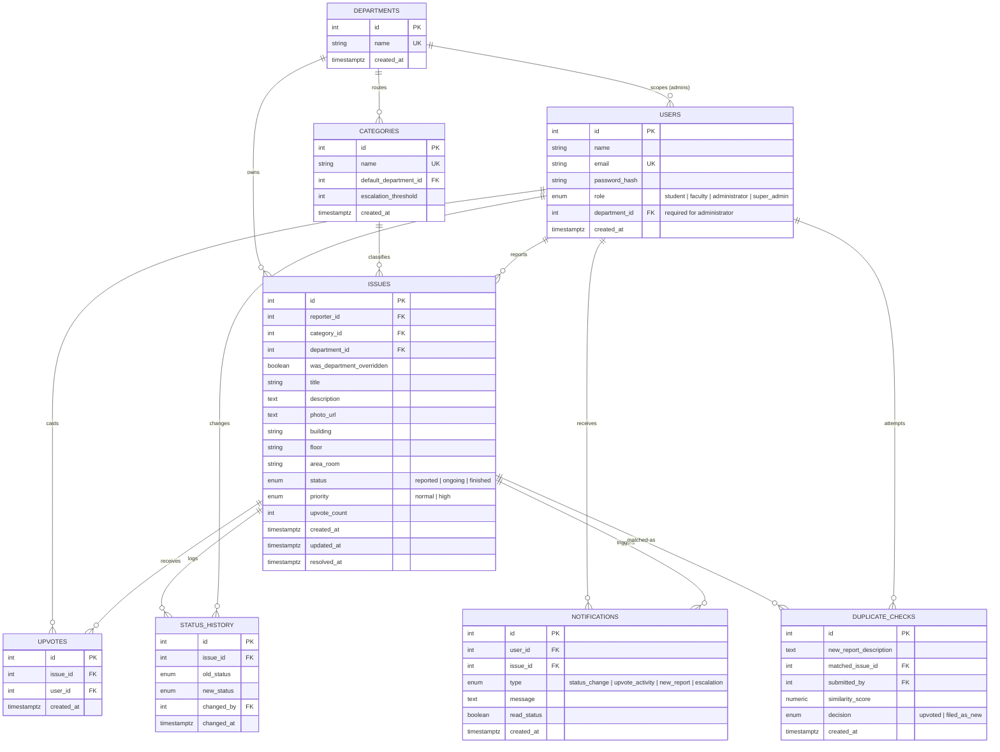

# Civic Issue Reporter — Entity-Relationship Diagram

This is the ER diagram for the database layer of the Civic Issue Reporter project
(UCS503P). It implements every entity implied by the README, the project
proposal, and the use-case diagram: the four roles (Student, Faculty,
Administrator, Super-Admin), department-scoped routing, duplicate detection,
auto-escalation, upvoting, and notifications.

## Cardinality notes

- One **department** owns many **categories** (a category's default routing
  target) and many **issues** (the department actually handling them — these
  can diverge when an override happens).
- One **department** scopes zero-or-more **administrator** users; students,
  faculty and the super-admin have `department_id = NULL`.
- One **user** (student/faculty) reports many **issues**; one **issue** has
  exactly one reporter.
- **Upvotes** is the many-to-many resolver between `users` and `issues`, with
  a `UNIQUE(issue_id, user_id)` constraint so a user can only upvote a given
  issue once — this is the DB-level fix for the "upvote gaming" risk called
  out in the proposal (§14).
- **Status_history** is an append-only audit log, one row per transition, so
  the required metrics (time-to-first-action, resolution time by category —
  proposal §8) can be computed directly from timestamps instead of being
  inferred from `issues.updated_at` alone.
- **Duplicate_checks** logs every duplicate-candidate decision (not just the
  ones that became upvotes), which is what the proposal's "duplicate-detection
  precision" metric (§8.1) is measured from.
